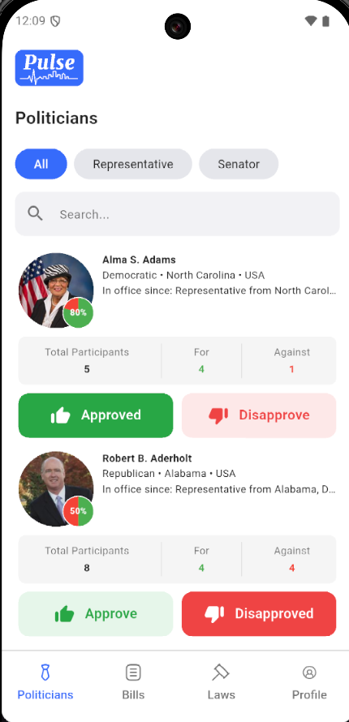
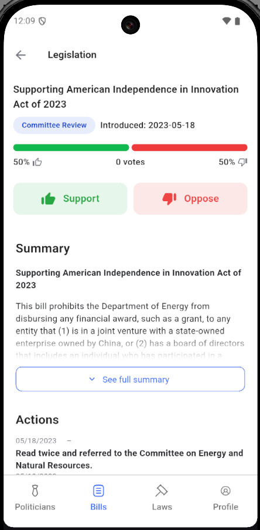
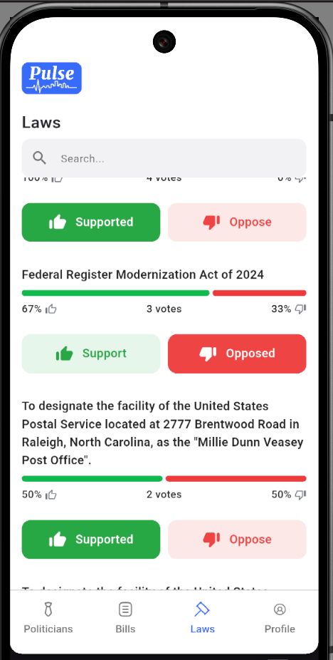
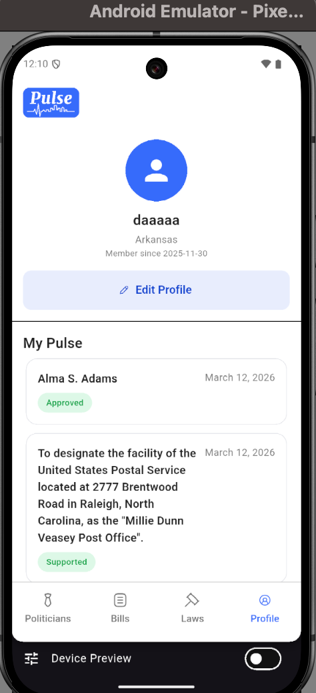

# Pulse

**Pulse** — a mobile app for civic engagement: rate politicians, vote on bills and laws, and track the activity of elected representatives.

> *"We the People — Rate politicians and their policies. Holding power to account."*

---

## Features

- **Politicians** — catalog with filters (chamber, search), detailed profiles, ratings, and demographic vote statistics
- **Bills** — list of bills, details, amendments, sponsors, related documents; support/oppose voting
- **Laws** — enacted laws, details, related bills; voting on laws
- **Profile** — vote history, interests, settings, profile editing
- **Auth** — OTP login, registration, token refresh
- **Offline** — "No internet" screen when connection is lost

---

## Screenshots

| Politicians | Bills | Laws | Profile |
|-------------|-------|------|---------|
|  |  |  |  |

---

## Tech Stack

| Category | Stack |
|----------|-------|
| **UI** | Flutter, Material Design |
| **Navigation** | Go Router |
| **State** | BLoC, Hydrated Bloc |
| **DI** | GetIt |
| **Network** | Dio |
| **Security** | Flutter Secure Storage |
| **Config** | flutter_dotenv (.env) |

---

## Architecture

The project follows **Clean Architecture**:

```
lib/
├── app/           # DI, routing, shell
├── core/          # auth, network, theme, widgets, failures
└── features/      # auth, bills, laws, politicians, profile, ...
    └── {feature}/
        ├── data/      # datasources, models, repositories
        ├── domain/    # entities, repositories, use cases
        └── presentation/  # bloc, screens, widgets
```

---

## Getting Started

### Requirements

- Flutter SDK >= 3.4.0
- Dart >= 3.4.0

### Installation

```bash
git clone <repo>
cd pulse
flutter pub get
```

### Configuration

Create a `.env` file in the project root (or copy from `.env.example`):

```env
BASE_URL=http://your-api-host/api/v1
```

### Run

```bash
flutter run
```

### Build

```bash
# APK
flutter build apk --release

# iOS
flutter build ios --release
```

---

## Screen Structure

| Tab / Screen | Description |
|--------------|-------------|
| **Politicians** | Politician list, filters, search |
| **Bills** | Bills, pagination, voting |
| **Laws** | Laws (Home), voting |
| **Profile** | Profile, vote history, settings |
| **Auth** | Login, Register, Verify OTP |

---

## Localization

Uses `flutter_intl` (intl_utils). Strings are in `lib/core/localization/l10n/`.

---

## License

Private
